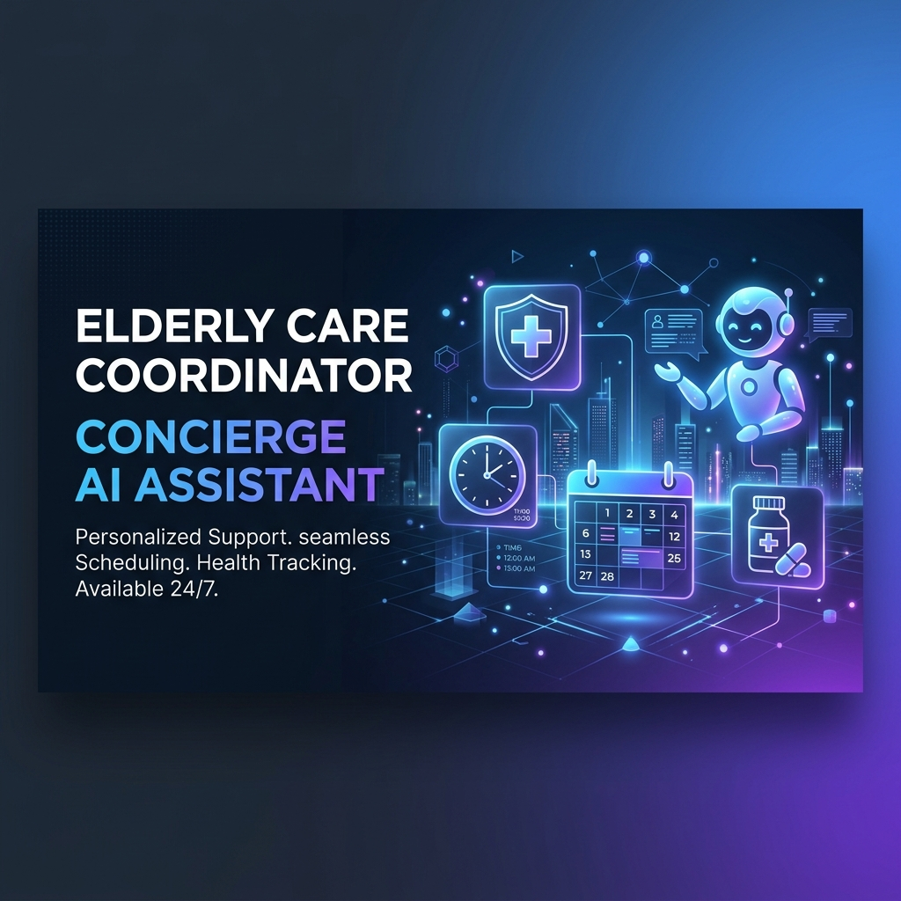
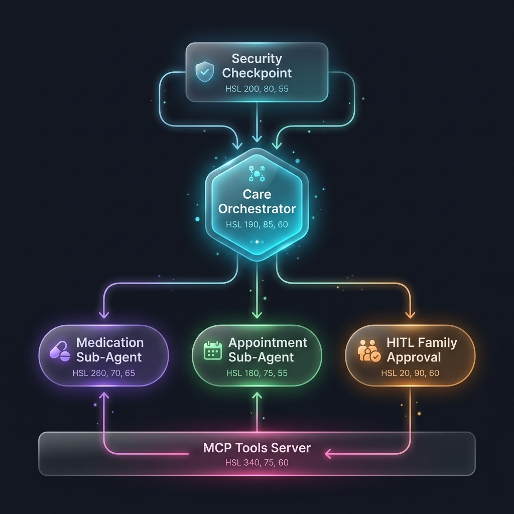

# Elderly Care Coordinator Agent

An advanced, safe concierge assistant built on ADK 2.0 to coordinate elderly caregiving coordinates (medications, doctor appointments, vital health logs) with built-in security screening and Human-in-the-Loop (HITL) safety checks.

---

## Architecture Overview

This coordinator is designed as an agentic workflow featuring:
* **Security Checkpoint Node**: Intercepts prompt injections, redacts SSN/Phone number PII, logs structured JSON audit trace, and warns on unsafe drugs (e.g. fentanyl, morphine).
* **Care Orchestrator (Single Turn)**: The routing node which parses requests and delegates sub-tasks.
* **Specialized Sub-Agents (Chat Mode)**:
  - **Medication Agent**: Interacts with medication-specific tools via MCP.
  - **Appointment Agent**: Schedules events and logs check-ins.
* **Stdio MCP Server**: Manages patient records locally inside `app/care_data.json` through tool interfaces.
* **Family Approval HITL**: Pauses execution and requests confirmation for scheduling or prescription modifications.



For a detailed design and fix walkthrough, refer to [SUBMISSION_WRITEUP.md](SUBMISSION_WRITEUP.md).


---

## Directory Structure

```
elderly-care-coordinator/
├── app/
│   ├── agent.py               # Core Workflow graph & agent definitions
│   ├── agent_runtime_app.py    # Vertex AI template setup & logging fallback
│   ├── config.py              # Universal configuration loaders
│   ├── mcp_server.py          # Stdio transport Model Context Protocol server
│   └── care_data.json         # Local database persistence file (generated)
├── tests/
│   ├── conftest.py            # Headless Google Auth test mock
│   ├── unit/                  # Unit test suite
│   └── integration/           # Multi-agent and runtime integration tests
├── SUBMISSION_WRITEUP.md      # Detailed system architecture writeup
└── pyproject.toml             # Python dependencies
```

---

## Quick Start

### 1. Prerequisites
- **uv**: Fast Python packaging manager.
- **agents-cli**: Google Agents CLI tool.
- An active Google Gemini API Key.

### 2. Configure Environment
Set up your Gemini Developer API Key in the `.env` file:
```env
GOOGLE_API_KEY=your_gemini_api_key
GOOGLE_GENAI_USE_VERTEXAI=False
GEMINI_MODEL=gemini-2.5-flash
```

### 3. Sync Virtual Environment
Install all dependencies and prepare the python virtual environment:
```bash
uv sync
```

---

## Local Development & Playground

To launch the local web playground server to interact with the agent:
```bash
uv run adk web app --host 127.0.0.1 --port 18081
```

Once running:
1. Open your browser to `http://127.0.0.1:18081`.
2. Ask a caregiving query:
   > *"Can you schedule a check-up appointment with Dr. John (General Physician) tomorrow at 2:00 PM to discuss BP variations?"*
3. The system will process it, scrub any PII, call the appointment agent tool, and trigger the **Family Approval** pop-up.
4. Respond `"yes"` to approve the schedule change.
5. The record will persist in `app/care_data.json`.

---

## Running Tests

To run the local unit and integration tests (fully mocked to not require GCP project credentials):
```bash
uv run pytest tests/
```

All 4 tests will collect and run cleanly.

---

## Push to GitHub

1. Create a new repo at https://github.com/new
   - Name: `elderly-care-agent1`
   - Visibility: Public or Private
   - Do NOT initialize with README (you already have one)

2. In your terminal, navigate into your project folder and run:
   ```bash
       cd elderly-care-agent1
   git init
   git add .
   git commit -m "Initial commit: elderly-care-agent1 ADK agent"
   git branch -M main
   git remote add origin https://github.com/mohithgowd8/elderly-care-agent1.git
   git push -u origin main
   ```

3. Verify `.gitignore` includes:
   ```
   .env          ← your API key — must NEVER be pushed
   .venv/
   __pycache__/
   *.pyc
   .adk/
   ```

> [!WARNING]
> **NEVER push `.env` to GitHub. Your API key will be exposed publicly.**


