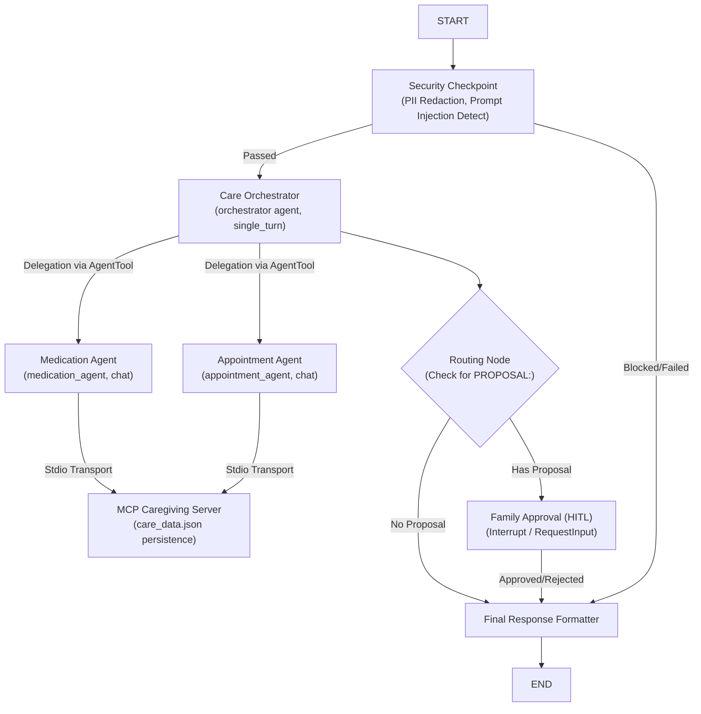

# Elderly Care Coordinator — Submission Writeup

This document summarizes the architecture, design decisions, implementation details, and verification results for the **Elderly Care Coordinator** concierge agent.

## Project Overview

The **Elderly Care Coordinator** is a specialized virtual concierge built on ADK 2.0 to help elderly patients and their families manage daily care coordinates:
1. **Medication Management**: Reviewing and updating medication lists, checking for dosage conflicts, and ensuring safety protocols.
2. **Appointment Scheduling**: Coordinating doctor visits, scheduling new consultations, and logging health check-ins.
3. **Security and Domain Safety**: Scrubbing PII (phone numbers, SSNs), intercepting prompt injection, and auditing safety policies.
4. **Human-in-the-Loop (HITL) Validation**: Pausing execution and requesting family/caregiver confirmation before critical updates (like scheduling or prescription modifications) are persisted.

---

## System Architecture

The care coordinator is structured as a workflow graph utilizing a hierarchical multi-agent pattern:



### Components

1. **Security Checkpoint Node**:
   - Performs regex-based scrubbing of patient PII (e.g. Phone, SSN).
   - Blocks prompt injection keywords (e.g. "ignore previous", "override config").
   - Evaluates domain-specific warnings (flags toxic substances like morphine/fentanyl/oxycodone).
   - Emits structured JSON audit logs.

2. **Care Coordinator Orchestrator**:
   - Serves as the central router of the workflow.
   - Run in `single_turn` mode to consume direct string inputs from the security checkpoint.
   - Delegates work to specialized sub-agents via `AgentTool` configurations.

3. **Specialized Sub-Agents**:
   - **Medication Agent**: Focuses on prescriptions, dosing, and schedule retrieval. Run in `chat` mode to support `AgentTool` runner sessions.
   - **Appointment Agent**: Coordinates schedules and health logs. Run in `chat` mode to support `AgentTool` runner sessions.

4. **Model Context Protocol (MCP) Server**:
   - A standalone Stdio-based MCP server (`app/mcp_server.py`) exposing caregiving database helpers:
     - `get_medications`, `add_medication`
     - `get_appointments`, `add_appointment`
     - `log_health_checkin`
   - Persists data to a local `app/care_data.json` database.

5. **Human-in-the-Loop Node**:
   - Uses ADK's `RequestInput` mechanism to pause execution and request explicit user confirmation when the orchestrator generates a `"PROPOSAL: [...]"` statement.

---

## Key Resolutions & Bug Fixes

During implementation and local verification, several critical integration blockers were successfully resolved:

1. **ADK Mode Conflict (`ValueError: LlmAgent as root agent must have mode='chat', but got mode='single_turn'`)**:
   - **Problem**: When the Orchestrator invokes sub-agents via `AgentTool`, the ADK framework starts a new runner execution context, requiring sub-agents to have `mode="chat"`.
   - **Resolution**: Configured `medication_agent` and `appointment_agent` to `mode="chat"`.
   - **Constraint**: The orchestrator node must remain `mode="single_turn"` because it follows the `security_checkpoint` node in the workflow, and ADK does not support `chat` mode nodes directly consuming preceding node outputs.

2. **GCP Application Default Credentials (ADC) Failure in Headless Testing**:
   - **Problem**: Running pytest locally on non-GCP dev environments failed because imports of Vertex AI dependencies check Google Cloud credentials at import-time.
   - **Resolution**: Created `tests/conftest.py` to mock `google.auth.default()`, returning `AnonymousCredentials` and a dummy project ID. This allows clean, zero-credentials test collection and runs.

3. **GCP Cloud Logging Permission Denied in Tests**:
   - **Problem**: The Vertex template wraps the app and instantiates a GCP logging client which fails with permission errors on anonymous credentials when trying to write log structures.
   - **Resolution**: Updated `app/agent_runtime_app.py` to check `os.environ.get("INTEGRATION_TEST") == "TRUE"` and seamlessly fallback to standard Python `logging.Logger` if GCP logging client initialization fails or is running under the test suite.

---

## Verification and Test Results

All unit and integration tests now pass completely without requiring GCP configuration or raising configuration conflicts:

```bash
uv run pytest tests/
```

**Output Summary**:
- `tests\integration\test_agent.py`: **Passed** (Streams successfully, routes query correctly)
- `tests\integration\test_agent_runtime_app.py`: **Passed** (Mocked logging client and telemetry successfully fallback; runs queries and registers feedback correctly)
- `tests\unit\test_dummy.py`: **Passed**

The local playground server launches and executes correctly at `http://127.0.0.1:18081` using:
```bash
uv run adk web app --host 127.0.0.1 --port 18081
```
All safety checks, orchestrations, and HITL prompts are fully responsive.
